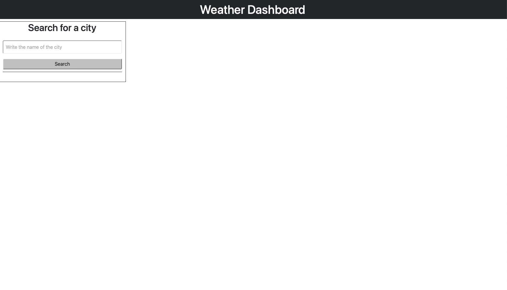
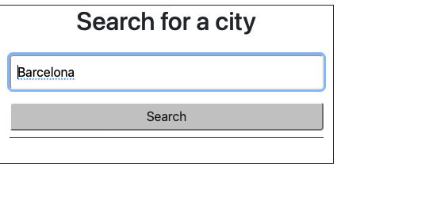
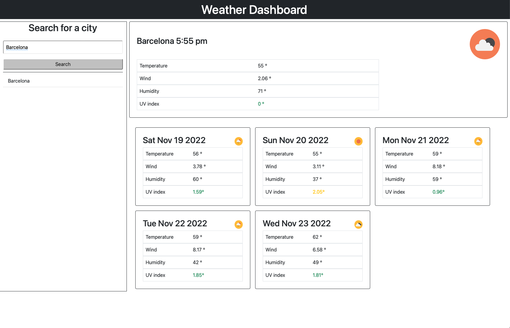

# Weather APP

# Links

[Github Deployed Link💾](https://frsargua.github.io/WeekSix_FS/)

# Table of Contents

- [Description](#description)
- [Installation](#Installation)
- [Usage](#Usage)
- [License](#License)
- [Contributing](#Contributing)
- [Tests](#Tests)
- [Questions](#Questions)

## Description

The app allows the user to obtain the current and a 5 day forecast of a location's weather. If needed , the user can later check the weather forecast again without the need to search by referring to the recent searches side column.

## Installation

To run the app in the local server, clone the repository to your local memory follow the instructions below:

```
Cd weeksix_fs
Open html file
Start live server     <--- To run the app in your live server
```

## Usage

```
Technologies used:
JavaScript - HTML - CSS- JQuery - Local Storage - JSON - Github Pages - Bootstrap

Technologies This app was constructed using HTML ,CSS , Bootstrap v5 and JQuery.HTML and CSS were used to build the skeleton and Bootstrap was used for speeding up the process fitting the components together. JQuery made the communication with the DOM straightforward. In addition, local storage was used to store the search results, so they could be retrieved later. The search functionality was powered by OpenWeatherMap. The request were made using FETCH requests.


```

- Below are screenshots of the deployed app in Heroku:
  
  
  

Functionality: - Look for the current weather and a 5 day forecast.

# License

This project is not covered by a license.

## Contributing

No contribution

## Tests

No tests available for this task.

## Questions:

GitHub: https://github.com/frsargua

email: frsargua@gmail.com
